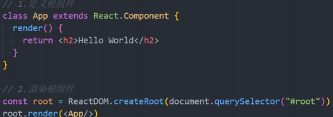
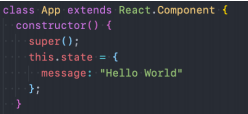

# 邂逅React开发

　　‍

## React的介绍和特点（技术角度）

* React是什么？

  * 用于构建用户界面的 JavaScript 库
* React的特点

  * **声明式编程**

    声明式编程是目前整个大前端开发的模式：Vue、React、Flutter、SwiftUI

    它允许我们只需要维护自己的状态，当状态改变时，React可以根据最新的状态去渲染我们的UI界面

    > 我们只需要去申明一些状态以及UI的样子，其他渲染成DOM事件监听的操作都交给了React（区别于原生自己createDOM以及监听事件等等
    >
  * **组件化开发**

    组件化开发页面目前前端的流行趋势，我们会将复杂的界面拆分成一个个小的组件
  * **多平台适配**

    2013年，React发布之初主要是开发Web页面

    2015年，Facebook推出了ReactNative，用于开发移动端跨平台；（虽然目前Flutter非常火爆，但是还是有很多公司在使用ReactNative）

    2017年，Facebook推出ReactVR，用于开发虚拟现实Web应用程序

　　‍

## Hello React案例

> 1、页面上给出一个按钮
>
> 2、点击按钮后将页面上原来显示的 <邂逅React开发> 变成 `<Hello React>`

* 第一步：在界面上通过React显示一个Hello World

  注意：这里我们编写React的script代码中，必须添加 type="text/babel"，作用是可以让babel解析jsx的语法
* ReactDOM. createRoot函数：用于创建一个React根，之后渲染的内容会包含在这个根中

  createRoot函数的参数：将渲染的内容，挂载到哪一个HTML元素上
* root.render函数

  函数的参数：要渲染的根组件

　　***我们可以通过{}语法来引入外部的变量或者表达式***

　　‍

## React开发依赖分析

* **开发React必须依赖三个库**

  * **react**：包含react所必须的核心代码
  * **react-dom**：react渲染在不同平台所需要的核心代码
  * **babel**：将jsx转换成React代码的工具

> 这三个库是各司其职，目的就是让每一个库只单纯做自己的事情
>
> 在React的0.14版本之前是没有react-dom这个概念的，所有功能都包含在react里；之所以做了拆分？原因是react-native。
>
> react包中包含了react web和react-native所共同拥有的核心代码
>
> react-dom针对web和native所完成的事情不同，分别将jsx渲染为真实DOM或原生控件

　　‍

* **React和Babel的关系**

  > Babel是目前前端使用非常广泛的编译器、转译器
  >
  > 比如当下很多浏览器并不支持ES6的语法，但是确实ES6的语法非常的简洁和方便，我们开发时希望使用它
  >
  > 那么编写源码时我们就可以使用ES6来编写，之后通过Babel工具，将ES6转成大多数浏览器都支持的ES5的语法
  >

  * 默认情况下开发React其实可以不使用babel
  * 但是前提是我们自己使用 React.createElement 来编写源代码，它编写的代码非常的繁琐和可读性差
  * 那么我们就可以直接编写jsx（JavaScript XML）的语法，并且让babel帮助我们转换成React.createElement

　　‍

* **依赖引入**

  * 直接CDN引入
  * 下载源码，添加本地依赖
  * 通过npm管理

　　‍

## React组件化的封装

* React的组件

  * 类组件
  * 函数组件
* **组件化**

  定义一个**类**（类名大写，若小写会被认为是HTML元素）

  实现当前组件的**render函数**（函数名是固定叫法），返回jsx内容就是react帮我们渲染的内容

  
* **组件化-数据依赖**

  组件中的数据分俩类

  1. **参与页面更新的数据**：当数据变化时，需要更新组件渲染的内容
  2. **不参与页面更新的数据**：当数据变化时，不需要更新组件渲染的内容

  参与页面更新数据，又称**参与数据流**，定义在组件的**state**（固定的对象名）中

  当数据发生变化时调用**this.setState**来更新数据，通知React进行update操作

  
* **组件化-事件绑定**

  > 这里要注意，点击事件的回调函数中this指 向关系
  >

  1. class组件中声明一个**实例方法**
  2. render函数中调用这个方法并指明this
  3. click回调方法中使用**setState**来修改组件状态，setState主要做俩件事

     将state中的message做出修改

     自动重新调用render函数

  ```ts
   // 组件方法
  btnClick() {
    this.setState({
       message: "Hello World"
     });
  }
  // 渲染内容 render方法
  render() {
    return (
      <div>
        <h2>{this.state.message}</h2>
        <button onClick={this.btnClick.bind(this)}>修改文本</button>
      </div>
    );
  }
  ```

  **优化：绑定this的处理方法2**

  提前给回调函数绑定好this

  ```ts
   constructor() {
            super();
            this.state = {
              message: "Hello World111"
            };

            // 提前绑定好this
            this.btnClick = this.btnClick.bind(this);
          }
  ```

> 说明：上述事件函数中this，默认指向undefined？？（一般指向节点对象比如button）
>
> 因为React并不是直接渲染成真实DOM，这里的button不过是一个语法糖，本质是React的Element对象
>
> 发生事件监听时，React在执行时并没有绑定this，so这里默认情况就指向了undefined

　　‍

　　‍

　　‍

## React其他案例实现

### 电影列表展示

　　‍

### 计数器案例

　　‍
