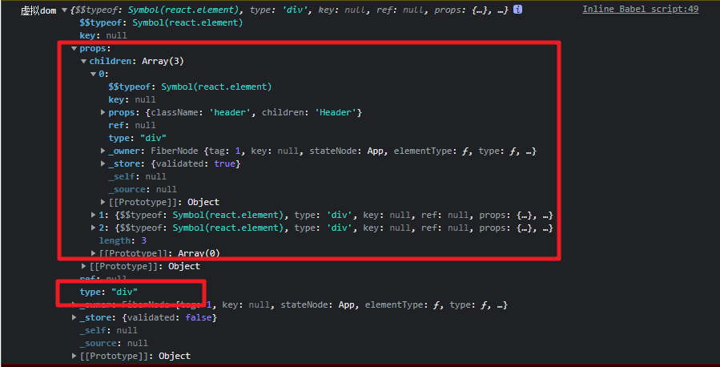
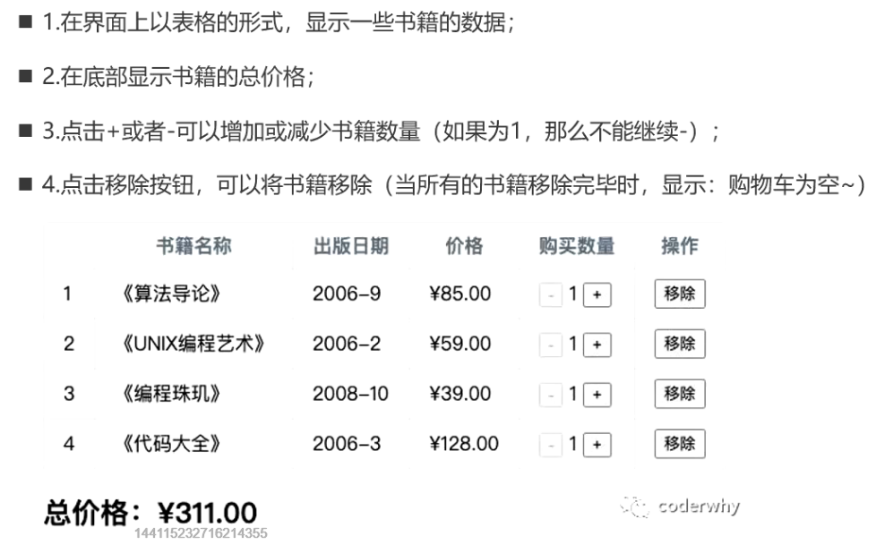

# JSX的语法解析

　　‍

## 认识JSX

### JSX是什么？

* JSX是一种**JS的语法扩展**，看起来像XML语法，故也称**JavaScript XML**
* 用于描述我们的UI界面，可以和JS融合在一起使用
* 不同于Vue的模板语法，不需要学它的一些指令

　　‍

### 为什么React选择JSX （面试题）

* React认为渲染逻辑本质上和其他的view逻辑存在耦合

  必须view需要绑定事件（button、a原生等）

  比如在view中展示数据状态

  比如在某些状态发生改变时，又要改变UI

　　**他们之间是密不可分，所以React没有将标记分离到不同的文件中，而是将它们组合到了一起，这个地方就是组件（Component）**

　　‍

### JSX的书写规范

* JSX的顶层只能有**一个根元素**，所以我们很多时候会在外层包裹一个div元素
* 通常在jsx的外层包裹一个小括号()，这样可以方便阅读，并且jsx可以进行换行书写
* JSX中的标签可以是单标签，也可以是双标签

  注意：如果是单标签，必须以/>结尾

　　‍

　　‍

## JSX的基本使用

* JSX的注释

  在脚手架框架中的.jsx文件中ctrl+/ 就是注释

  ```ts
  return (
              <div>
                {/* JSX的注释写法 */}
                <h2>{message}</h2>
              </div>
            );
  ```
* **JSX插入变量作为子元素**

  **情况一**：内容是**Number、String、Array**类型时，**可直接显示**

  **情况二**：当变是**null、undefined、Boolean**类型时，**内容为空**

  > 如果希望可以显示null、undefined、Boolean，那么需要转成字符串
  >
  > 转换的方式有很多，比如toString方法、和空字符串拼接，String(变量)等方式
  >

  **情况三**：**Object对象类型不能作为子元素**
* JSX插入表达式

  运算表达式

  三元运算符

  执行一个函数
* **JSX绑定属性**

  title、src、href、

  绑定class属性动态：

  1. 一：动态拼接字符串
  2. 二：class列表
  3. 三：第三方库 classnames

  ```ts
  // 1. 方法一：动态拼接字符串
            const className = `abc cba ${isActive ? "active" : ""}`;
            // 2. 方法二：将所有class放到数组中
            const classList = ["abc", "cba"];
            if (isActive) classList.push("active");
            // 3. 方法三：使用第三方库classnames 以后讲

            return (
              <div>
                {/*绑定class*/}
                <h2 className={className}>第一种</h2>
                <h2 className={classList.join(" ")}>第二种</h2>
              </div>
            );
  ```

  绑定内联样式style

  ```jsx
    {/* 绑定style */}
  <h2 style={{ color: "red", fontSize: "20px" }}>呵呵</h2>
  <h2 style={styleObj}>呵呵</h2>
  ```

　　‍

　　‍

## 🏀JSX的事件绑定

* React绑定事件 VS 原生

  * 原生：获取dom原生 -> 添加监听事件；；可以直接添加onclick事件
  * React：采用小驼峰的onClick，在 { } 中添加事件处理函数
* this绑定的问题

  * 点击事件触发后，发现事件处理函数中this指向undefined

    > 原因是btnClick函数并不是我们主动调用的，而且当button发生改变时，React内部调用了btnClick函数
    >
    > 而它内部调用时，并不知道要如何绑定正确的this
    >
  * 解决this绑定问题

    * 使用bind显示绑定this
    * ES6 的class fields语法
    * **事件监听传递箭头函数**

    ```jsx
    btn1Click() {
              console.log("按钮一", this);
            }
            btn2Click = () => {
              console.log("按钮二", this);
            };
            btn3Click = () => {
              console.log("按钮三", this);
            };
            render() {
              const { message, counter } = this.state;
              return (
                <div>
                  {/* 1、this绑定一：显示bind绑定 */}
                  <button onClick={this.btn1Click}>按钮一</button>
                  {/* 2、this绑定二：class fields语法 */}
                  <button onClick={this.btn2Click}>按钮二</button>
                  {/* 3、this绑定三：事件监听传递箭头函数 */}
                  <button onClick={() => this.btn3Click()}>按钮三</button>
                </div>
              );
            }
    ```
* 事件参数传递

  1. 用bind绑定this传递参数

     传额外参数会有问题

     ```jsx
     <button onClick={this.btnClick.bind(this)}>按钮1</button>
     <button onClick={(event) => this.btnClick(event)}>按钮2</button>
     ```
  2. **推荐使用箭头函数形式传参**

     ```jsx
      <button onClick={(event) => this.btnClick(event, "www", 18)}>
                     按钮4
                   </button>
     ```

　　‍

## JSX的条件渲染

* 常见条件判断

  * **条件判断语句**：适合逻辑比较多的情况

    ```jsx
    let showElement = null;
    if (isReady) {
      showElement = <h2>准备开始比赛吧！！！</h2>;
    } else {
      showElement = <h1>请做好准备先！！！</h1>;
    }

    。。。。

      {/* 1. 条件判断 */}
      <div>{showElement}</div>
    ```
  * **三元运算符**：适合逻辑比较简单的

    ```jsx
     {/* v-show的效果 */}
    <h2 style={{ display: isShow ? "block" : "none" }}>{message}</h2>
    ```
  * **&amp;&amp; 运算符**：适合如果条件成立，渲染某一个组件；如果条件不成立，什么内容也不渲染

    ```jsx
    <div>{isShow && <h2>{message}</h2>}</div>
    ```
  * 可选链 后面讲

　　‍

## JSX的列表渲染

　　大多会配合数组高阶函数做列表渲染

```jsx
{students
  .filter((student) => student.score > 100)
  .slice(0, 2)
  .map((student) => {
    return (
      <div className="item" key={student.id}>
        <h2>学号：{student.id}</h2>
        <h2>姓名：{student.name}</h2>
        <h2>得分：{student.score}</h2>
        </div>
    );
  })}
```

　　‍

## JSX的原理和本质

* **jsx 仅仅只是 React.createElement(component, props, ...children) 函数的语法糖**
* createElement需要传递三个参数:

  * **type**：

    * 当前ReactElement的类型
    * 如果是标签元素，那么就使用字符串表示 “div”
    * 如果是组件元素，那么就直接使用组件的名称
  * **config**：

    * 所有jsx中的属性都在config中以对象的属性和值的形式存储
    * 比如传入className作为元素的class
  * **children**：

    * 存放在标签中的内容，以children数组的方式进行存储

> 可以借助babel官网 看到jsx -> React.createElement的聚提表现

　　‍

## 虚拟DOM的创建过程

* 通过 React.createElement 最终创建出来一个 ReactElement对象
* React利用ReactElement对象组成了**一个JavaScript的对象树**

  JavaScript的对象树就是虚拟DOM（Virtual DOM）
* 我们可以将之前的jsx返回结果进行打印

　　‍

* JSX -> 虚拟DOM -> 真实DOM

　　‍

### 为何要使用虚拟DOM（面试题）

* 当我们有数据更新时，会生成一个新的虚拟DOM对象，react根据新旧虚拟DOM对象的diff算法对比，最小化的改变变了的地方，**提高性能**
* react可以通过桥接技术，把虚拟DOM对象转变成IOS/安卓的控件，实现了**跨平台**
* 虚拟DOM帮助我们从命令式编程转变为**声明式编程**

  > React官方的说法：Virtual DOM 是一种编程理念
  >
  > 在这个理念中，UI以一种理想化或者说虚拟化的方式保存在内存中，并且它是一个相对简单的JavaScript对象
  >
  > 我们可以通过root.render让 虚拟DOM 和 真实DOM同步起来，这个过程中叫做协调（Reconciliation）
  >
  > 这种编程的方式赋予了React声明式的API：
  >
  > 你只需要告诉React希望让UI是什么状态
  >
  > React来确保DOM和这些状态是匹配的
  >
  > 你不需要直接进行DOM操作，就可以从手动更改DOM、属性操作、事件处理中解放出来
  >

　　‍

　　‍

## 阶段案例

　　

* react的列表渲染通常会使用map高阶函数
* 修改state中引用类型的数据时

  1. 先浅拷贝一个新的对象
  2. 修改新的对象  将新对象赋给state中的数据

  ```jsx
  remove(index) {
            const newBooks = [...this.state.books];
            newBooks.splice(index, 1);
            this.setState({
              books: newBooks
            });
          }
  ```
* 抽离不同模块代码

  比如上述表格 有数据时显示表格 无数据时显示“表格为空”

  若直接在render中使用变量进行抽离 render会变的不易读；；可以将俩种情况分别抽离俩函数  render函数中根据具体情况去执行函数

  ```jsx
  renderTableList() { ... }
  renderTableEmpty() { ... }
  render() {
            return books.length
              ? this.renderTableList()
              : this.renderTableEmpty();
          }
  ```

　　‍
