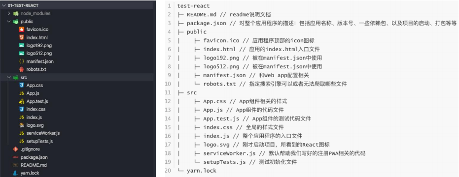

# React脚手架

　　‍

## 认识脚手架工具

### 什么是脚手架

* 编程中提到的脚手架（Scaffold），其实是一种工具，帮我们可以快速生成项目的工程化结构

  * 每个项目作出完成的效果不同，但是它们的**基本工程化结构**是相似的
  * 既然相似，就没有必要每次都**从零开始搭建**，完全可以使用一些工具，帮助我们生产基本的工程化模板
  * 不同的项目，在这个模板的基础之上进行项目开发或者进行一些配置的简单修改即可
  * 这样也可以间接保证项目的**基本机构一致性，方便后期的维护**

　　**总结：脚手架让项目从搭建到开发，再到部署，整个流程变得快速和便捷**

　　‍

## 前端脚手架

* 对于现在比较流行的三大框架都有属于自己的脚手架

  * Vue的脚手架：@vue/cli
  * Angular的脚手架：@angular/cli
  * React的脚手架：create-react-app
* 它们的作用都是帮助我们生成一个通用的目录结构，并且已经将我们所需的工程环境配置好
* 使用这些脚手架需要依赖什么呢

  * 目前这些脚手架都是使用node编写的，并且都是基于webpack的

　　‍

## create-react-app

* React的脚手架
* 下载node环境
* ​`npm i create-react-app -g`​ 下载脚手架

　　‍

　　‍

## 创建React项目

* 创建react

  1. 输入创建命令 `create-react-app 项目名称`​

      > 项目名称中：不能包含大写字母
      >
      > 且父级文件夹名称不能有中文
      >
  2. 也可以在GitHub的readme中创建

* 目录结构分析

  ​​

　　‍

### 了解PWA（了解）

* PWA全称**Progressive Web App**，即**渐进式WEB应用**
* 一个 PWA 应用首先是一个网页, 可以通过**​ Web 技术**编写出一个网页应用
* 随后添加上 **App Manifest** 和 **Service Worker**​ ​来实现 PWA 的**安装和离线****等**功能
* 这种Web存在的形式，我们也称之为是 **Web App**

　　‍

* PWA解决了那些问题

  * 可以**添加至主屏幕**，点击主屏幕图标可以实现启动动画以及隐藏地址栏
  * 实现**离线缓存功能**，即使用户手机没有网络，依然可以使用一些离线功能
  * 实现了**消息推送**
  * 等等一系列类似于Native App相关的功能

> 更多查看MDN

　　‍

## webpack的配置

* **React脚手架默认是基于Webpack来开发的**
* 但是，很奇怪：我们并没有在目录结构中看到任何webpack相关的内容？

  * 原因是React脚手架**将webpack相关的配置隐藏起来**了

  > 其实从Vue CLI3开始，也是进行了隐藏
  >

* 如何看到脚手架中webpack的配置信息？？

  * 执行package.json中的脚本：`"eject": "react-scripts eject"`​
  * 它会将webpack的配置提取出来，并且这个操作不可逆

　　‍

## 从零编写代码

　　~~~

　　‍
